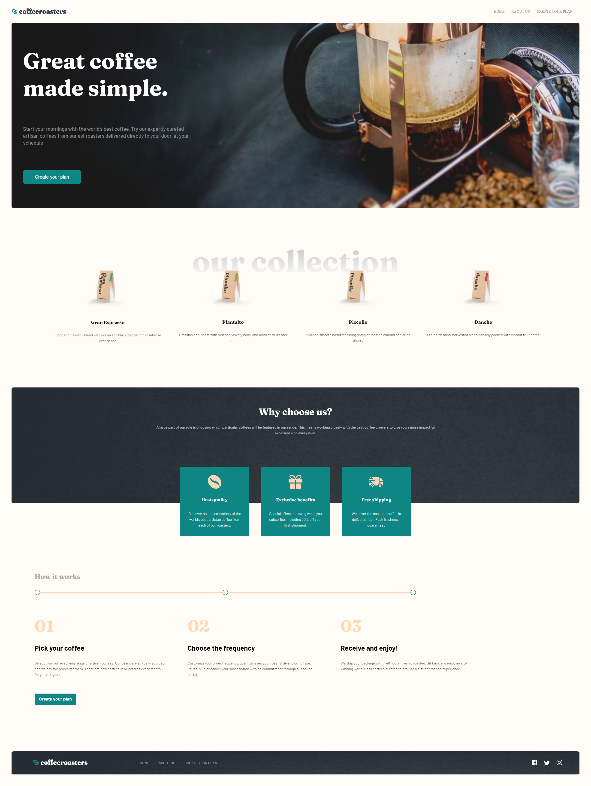

# ☕ Coffee Subscription App

This is a web application that allows users to subscribe to a coffee delivery service. Users can customize their coffee preferences and choose a subscription plan that best suits their needs. The app is designed to be user-friendly and fully responsive.

## Live Demo

You can explore the app live by visiting [Live Demo](https://coffee-subscription.vercel.app/).

## Features

- Choose from a variety of coffee options and customize your order.
- Select a subscription plan (weekly, bi-weekly, or monthly).
- User-friendly interface for smooth navigation.
- Fully responsive design, ensuring a seamless experience on mobile, tablet, and desktop devices.

## How It Works

1. Select your preferred coffee type and customization options.
2. Choose a subscription plan (delivery frequency).
3. Confirm your subscription, and enjoy fresh coffee delivered to your door.

## Technologies Used

- HTML
- CSS
- JavaScript
- React
